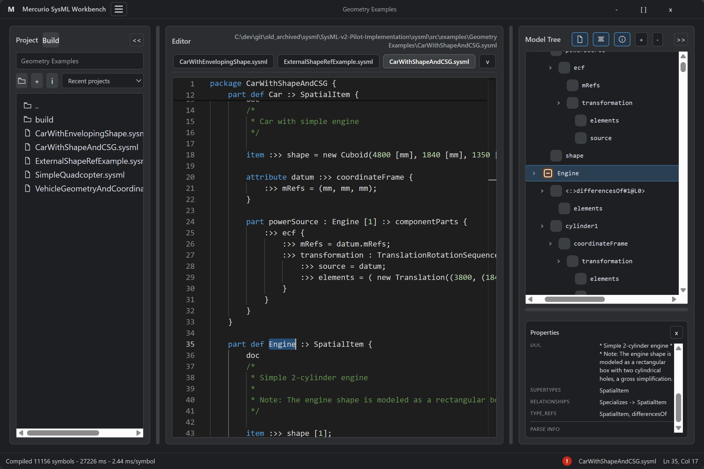

# Mercurio SysML Workbench

## Description
Mercurio is a desktop SysML/KerML workbench built with Tauri. It combines a Rust backend with a web-based UI to let you browse, edit, and analyze model files in a local project workspace.




## Overview
- Pick a project root and browse files in the project tree.
- Edit SysML/KerML sources in a Monaco-based editor.
- Compile the workspace to build a model tree and surface semantic information.
- Review parse errors, unresolved references, and symbol details.
- Toggle library symbols, grouping, and properties in the model view.

## Features
- Local project browser with recent-project support.
- Monaco editor with tabs and per-file parsing feedback.
- Workspace compilation to build a navigable model tree.
- Symbol metadata, relationships, and properties panel.
- Optional display of standard library symbols.
- File-system watching to refresh state on changes.

## Build and Run
### Prerequisites
- Rust toolchain (stable).
- Tauri CLI (`cargo install tauri-cli`).

### Run (dev)
```powershell
cd mercurio-application
cargo tauri dev
```

### Build (bundle)
```powershell
cd mercurio-application
cargo tauri build
```
